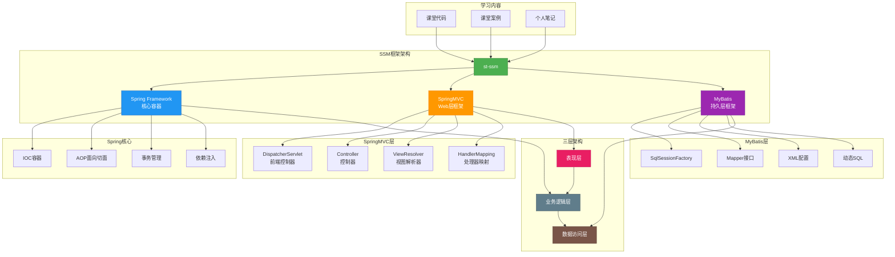

# :star: st-ssm.github.io

整个ssm的笔记项目。暂时告一段落。

本项目旨在学习和记录 Spring、SpringMVC 和 MyBatis 框架，主要包括课堂代码、课堂案例和个人笔记。

## 📊 项目架构图

## 背景

在当今的 IT 行业，Spring、SpringMVC 和 MyBatis 三者组合，是非常流行的一种三层架构，用于构建 Java 应用程序。本项目旨在帮助用户深入学习三者的有关知识，掌握经典案例，从而更好地应用三者构建项目，提升自身能力。

## 内容

本项目主要包括课堂代码、课堂案例和个人笔记：

- 课堂代码：收集教程的所有课堂代码，以便于后期查阅和复习。
- 课堂案例：根据教程中的案例，提供完整的案例代码，以便于用户学习和实践。
- 个人笔记：记录个人学习过程中的一些心得和体会，帮助自己更好地理解和掌握知识点。

## 目标

本项目旨在帮助用户深入学习 Spring、SpringMVC 和 MyBatis，掌握经典案例，从而更好地应用三者构建项目，提升自身能力。
